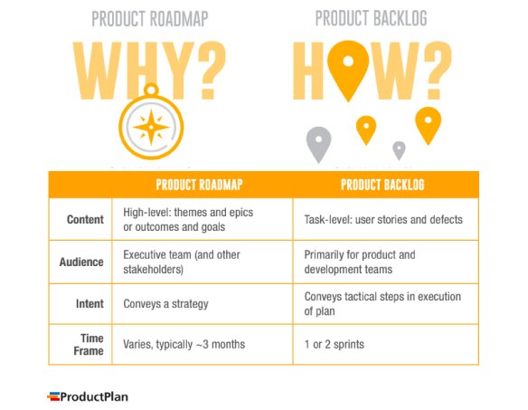
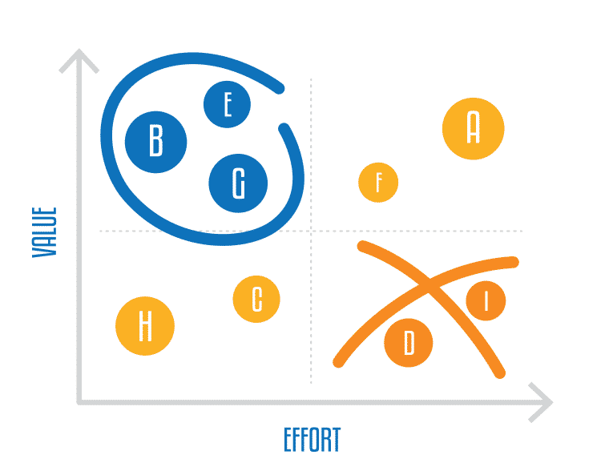
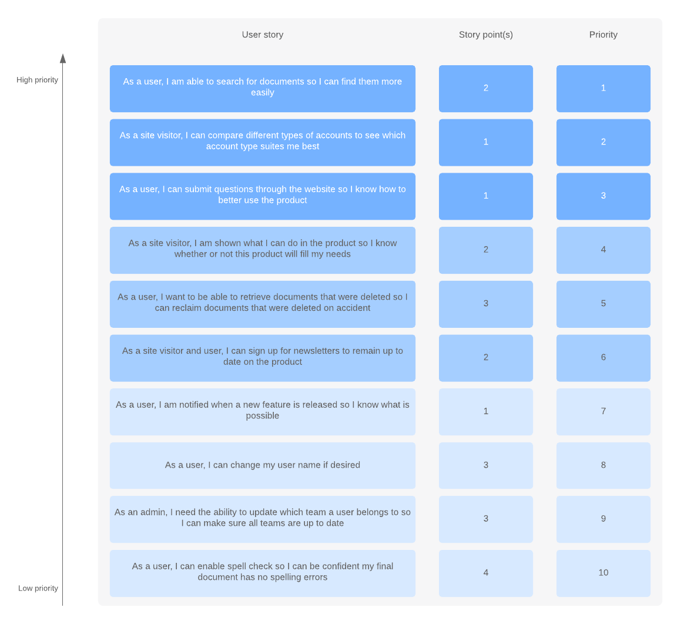
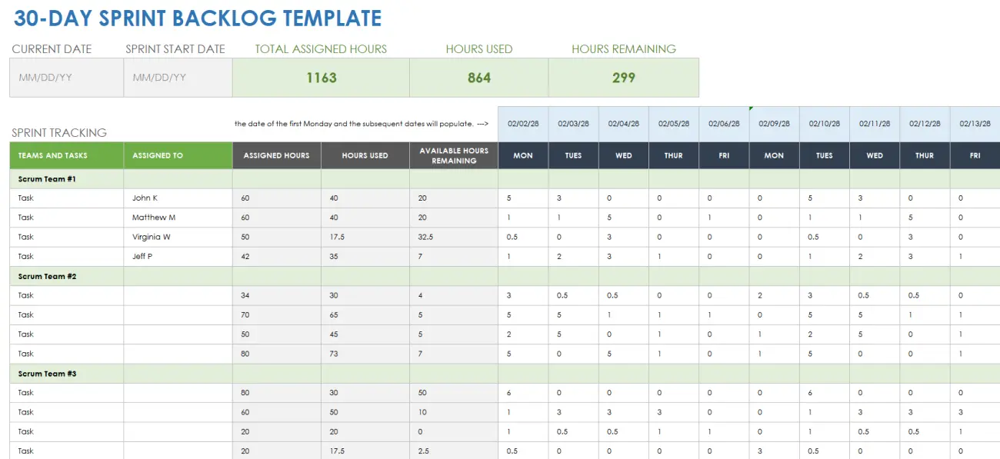
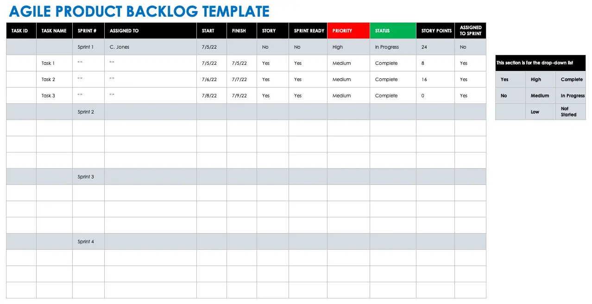

<h1>Product Roadmap & Backlog</h6>

By the end of this lesson, you will be able to:
* Define and relate the following terms: product roadmap, themes/initiatives, and epics
* Identify the essential elements and articulate the importance of product backlogs

<h6>Product Roadmaps</h6>

A **product roadmap** is a plan for where a product is going. Just like builders use blueprints to build houses, product managers use product roadmaps. Product roadmaps align a product team and provide a prioritized, operational order of how they’ll get there. They describe the product strategy and vision, guide the execution, and keep all stakeholders (product team, leadership, etc.) on the same page. Roadmaps include:
* The vision for the product
* What the product will do and/or what features will be added
* An estimation of how long priorities will take to complete
* Target release or launch dates

Product roadmaps should be:
* Created after defining the product vision and strategy, as it is a guiding document for future work
* Connected to company goals and vision
* Plans to solve problems, not just add abstract features
* Living documents that are flexible enough to incorporate changing company priorities and user needs
* Updated regularly
* Plans for the next 3, 6, or 12 months (and may need to be adjusted in that time frame)

Cagan writes, on the best product teams, “it's all about solving problems, not implementing features. Conventional product roadmaps are all about output. Strong teams know it's not only about implementing a solution. They must ensure that the solution solves the underlying problem. It's about business results” (Cagan, 2008). 

A product roadmap can be created in several different ways and varies based on the company, industry, or team. Product managers should leverage the work they have done leading up to this (product vision boards, product hypotheses, market research, user interviews, etc.) to work with their team to prioritize initiatives on their roadmap. The product team should meet several times to brainstorm how they will achieve their product vision and iterate on those ideas. Once a product manager has a draft roadmap, they should solicit feedback from the product team before finalizing and presenting it to stakeholders. 

Typically, roadmaps display different levels of hierarchy and contain the following elements: 

| Element               | Definition                                                                                                                                                                                                                                                                                                                                                                                                                                                                                                                                                                                      |
|-----------------------|-------------------------------------------------------------------------------------------------------------------------------------------------------------------------------------------------------------------------------------------------------------------------------------------------------------------------------------------------------------------------------------------------------------------------------------------------------------------------------------------------------------------------------------------------------------------------------------------------|
| Vision                | Product vision  “refers to the longer-term objective of this product, normally 2-10 years out. It is how we as a product organization intend to deliver on the company’s mission” (Cagan, 2008). This should be a one-to-two sentence statement that explains why your product exists.   It is helpful to add your product vision to as many documents as possible to ground the team in what you all are trying to achieve. By having the product vision on the roadmap, when you are adding new features or tasks, you can always ensure those help you and the team reach your vision. |
| Sprints               | Sprints are short periods of time, typically two weeks or one month, when your product team works to complete a set amount of work. Sprints often define the amount of time your product team has to complete a series of tasks on a product roadmap                                                                                                                                                                                                                                                                                                                                            |
| Themes of Initiatives | Themes are company-wide focus areas. They should be one level deeper than the product vision. Themes should be written in plain language and easy to communicate to your stakeholders. Within themes, you will break down the work into related epics. You may see the terms “themes” and “initiatives” used interchangeably.                                                                                                                                                                                                                                                                   |
| Epics                 | Epics are a group of stories with a common objective within a theme. The stories will be the specific features or tasks your product team will be working on. Epics can span more than one sprint depending on the amount of work to be completed.                                                                                                                                                                                                                                                                                                                                              |
| Stories               | Depending on the format and the audience of your roadmap, you may or may not include stories on your roadmap. Stories will detail requirements for tasks the product needs to complete within a sprint.                                                                                                                                                                                                                                                                                                                                                                                         |
| Milestones            | Milestones are key moments within the roadmap to ensure your product team is accomplishing work that leads to your overall vision and theme.                                                                                                                                                                                                                                                                                                                                                                                                                                                    |

There are several considerations and best practices when roadmapping: 

1. **Estimating is one of the most important parts of building a roadmap.** Product managers will need to ask developers to guess the time it will take them to complete a given story. Routinely checking in with developers and learning more about their pace helps PMs estimate the time needed. Related, PMs should overestimate the time it is going to take to complete a task. Distractions and roadblocks are common, so it’s better to overestimate than underdeliver. 
2. **A PM owns the roadmap and is accountable for it.** Product managers should be prepared to defend decisions about what makes it on a roadmap and what does not. When presenting the roadmap to stakeholders, determine the appropriate visual aid, know your audience, and tie in metrics to gain buy-in.
3. The product team “is not off the hook just by delivering a requested feature or project. **The feature must solve the business problem** (as measured by the key results); otherwise, the team needs to try a different approach to the solution” (Cagan, 2008). 
4. Roadmaps are often a tool to present the team’s priorities. Depending on the audience, **roadmaps should only include necessary details.** If presenting to executive leadership, do not include detailed stories, as it will distract from the themes and priorities of the roadmap. 
5. **By using the hierarchy of themes, epics, and stories, each item on a roadmap will be related to the overall product vision.** By connecting a user story to its related epic and theme, the product team and stakeholders will understand why they are doing the work. 
6. **Roadmaps for new products and mature products will look different.** A new product will likely have a roadmap that leads them to an MVP and they may not understand which features they want to include after that first release. A more mature product will probably have a longer-term roadmap, more dependencies to understand and incorporate, and a deeper understanding of its users. 

<h6>Product Backlogs</h6>

A **product backlog** is a more granular view of the plans for a given product via a prioritized list of requirements - features, bug fixes, technical debt, and other technical work - derived from the product roadmap. A product backlog will never be complete, because a product team should always be evolving and improving their product. A new product will have a much shorter backlog than a more mature product, because a mature product will have more bug fixes and user feature requests. Dan Radigan writes, a well-prioritized backlog “not only makes release and iteration planning easier, it broadcasts all the things your team intends to spend time on - including internal work that the customer will never notice. This helps set expectations with stakeholders and other teams, especially when they bring additional work to you” (Radigan, 2023). When initially creating a product backlog, the product team can list high-priority items and abstract ideas for the future. The next step is to prioritize all of those items to align with the product roadmap. The image below shows a helpful depiction of how a product roadmap and product backlog should interact.

**Backlog refinement**, or **backlog grooming**, is the process of selecting items from the prioritized backlog to tackle in preparation for each sprint. The most important stories should be at the top of the backlog. Stories can be categorized into near-term and long-term. Radigan writes, for near-term items, “complete user stories have been drawn up, collaboration with design and development has been sorted out, and estimates from development have been made. Longer term items can remain a bit vague, though it's a good idea to get a rough estimate from the development team to help prioritize them” (Radigan, 2023). 

To prioritize the backlog, product managers should consider which items will provide the most value for their end user. There are many strategies to do this. 
1. The **value vs. effort matrix** is a method you may use to evaluate user stories. Create a graph with one axis as “Complexity/Effort” and one as “Value” like the image below.

From there, with the product team, place your user stories on the graph. User stories that are high effort and low value should be deprioritized, while stories that are low effort and high value - or “quick wins” should be prioritized. 
2. Items on the product backlog should answer the following **four critical questions:** 
* Will the user buy this (or choose to use it)?
* Can the user figure out how to use this? 
* Can our engineers build this?
* Can our stakeholders support this?” (Cagan, 2008)
If the answer is yes to all four questions, the user story should be prioritized.
3. Categorize stories by urgency, importance, and complexity. 
* User stories that are urgent - that improve the functionality of the product - should be prioritized. 
* User stories that are important - that improve the user experience - should be prioritized. 
* And last, user stories that are complex - that may take more thought or effort - should be prioritized since the backlog will continue to grow over time.  

The table below provides best practices and tips for managing a product backlog. 

| Communication | Involve your product team when verifying time estimates, adding details to user stories, and discussing/agreeing upon the most important priorities. It’s also important to identify with your developers any blockers, dependencies, or competing work requirements. If a user story is too big, work with the team to break it into smaller ones. |
|---------------|-----------------------------------------------------------------------------------------------------------------------------------------------------------------------------------------------------------------------------------------------------------------------------------------------------------------------------------------------------|
| Tags          | Tag your user stories in your backlog with different tags to categorize them. User stories should be tagged to a particular epic from the roadmap. A team member should be assigned as the lead for the user story as well.                                                                                                                         |
| Icebox        | An icebox is a separate part of your product backlog where you can put user stories that you are not ready for, or that you know no one will work on anytime soon. You don’t want to lose these ideas, but they don’t need to be a part of your main backlog.                                                                                       |
| Out of Scope  | “Once the backlog grows beyond the team's long term capacity, it's okay to close issues the team will never get to. Flag those issues with a specific resolution like ‘out of scope’ in the team's issue tracker to use for research later” (Radigan, 2023).                                                                                        |

There are many different tools for creating and managing product backlogs and many different formats. The images below include a few examples.

<!-- Question #1 -->

### !challenge

* type: ordering
* id: 75e9a2d9-d847-46a8-9ca1-efd781313319
* title: Definitions

##### !question

**Read the following scenario and then match the description to the term in the order below.**

Scenario: Spotify, the audio streaming service, wants to introduce a new feature that will add similar songs to a user’s personal playlist. 
* Product Roadmap
* Product Vision
* Sprint
* Theme/Initiative
* Epic
* Story
* Milestone

##### !end-question

##### !answer

1. The blueprint and plan for adding new features and improving Spotify.
2. The Spotify app will unlock the potential of human creativity—by giving a million creative artists the opportunity to live off their art and billions of fans the opportunity to enjoy and be inspired by it.
3. #1: January 1 - 30, 2024
4. Introduce users to new music from artists they may or may not know already.
5. Add an “enhance” feature to add recommended songs to a user’s personal playlist.
6. As a user, after I create a playlist, I want to see a button that will add recommended and similar songs to my playlist. 
7. Enhance feature shipped to target group of users - January 30, 2024

##### !end-answer

### !end-challenge

<!-- ======================= END CHALLENGE ======================= -->

<!-- Question #2 -->

### !challenge

* type: ordering
* id: 3c2cd29b-0be9-4578-bc54-c795dddf9ea7
* title: Roadmap Tiers

##### !question

Order the following elements of a product roadmap from highest-level to most granular.

Theme/Initiative
Epic
Stories
Vision

##### !end-question

##### !answer

1. Vision
2. Theme/Initiative
3. Epic
4. Stories

##### !end-answer

### !end-challenge

<!-- ======================= END CHALLENGE ======================= -->

<!-- Question #3 -->

### !challenge

* type: multiple-choice
* id: b711e11e-9b19-4174-ae72-fa4c442d5bf0
* title: Product Backlog

##### !question

Which of the following best defines a product backlog?

##### !end-question

##### !options

a| A strategic plan for where a product is going, aligns a product team, and provides a prioritized, operational order of how they’ll get there. 
b| A more granular view of the plans for a given product via a prioritized list of requirements - features, bug fixes, technical debt, and other technical work - derived from the product roadmap. 
c| A collection of company-wide focus areas that may align to OKRs. They are written in plain language and easy to communicate to your stakeholders. 

##### !end-options

##### !answer

b| A more granular view of the plans for a given product via a prioritized list of requirements - features, bug fixes, technical debt, and other technical work - derived from the product roadmap. 

##### !end-answer

### !end-challenge

<!-- ======================= END CHALLENGE ======================= -->

<!-- Question #4-->

### !challenge

* type: checkbox
* id: ec8e5160-30d8-41b3-87af-f768dec725a7
* title: Product Backlog

##### !question

Select all that apply: A product backlog can include which of the following?

##### !end-question

##### !options

* Bug Fixes
* Milestones
* Technical Debt
* Features
* Sprints
* Technical Work
* Themes

##### !end-options

##### !answer

* Bug Fixes
* Technical Debt
* Features
* Technical Work

##### !end-answer

### !end-challenge

<!-- ======================= END CHALLENGE ======================= -->

<!-- Question #5-->

### !challenge

* type: checkbox
* id: be5bbd14-e6d7-4f84-8ba0-72309d260a77
* title: Product Backlog

##### !question

Select all that apply: A product backlog, and backlog refinement, are important because they… 

##### !end-question

##### !options

* Convey tactical steps in the execution of the plan
* Set the vision for the product
* Broadcast all the things the product team intends to spend time on
* Serve as high-level plans to share with stakeholders
* Prioritize user stories that are low effort and high value
* Estimate time required for user stories
* Identify items that are out of scope for the product

##### !end-options

##### !answer

* Convey tactical steps in the execution of the plan
* Broadcast all the things the product team intends to spend time on
* Prioritize user stories that are low effort and high value
* Estimate time required for user stories
* Identify items that are out of scope for the product

##### !end-answer

### !end-challenge

<!-- ======================= END CHALLENGE ======================= -->